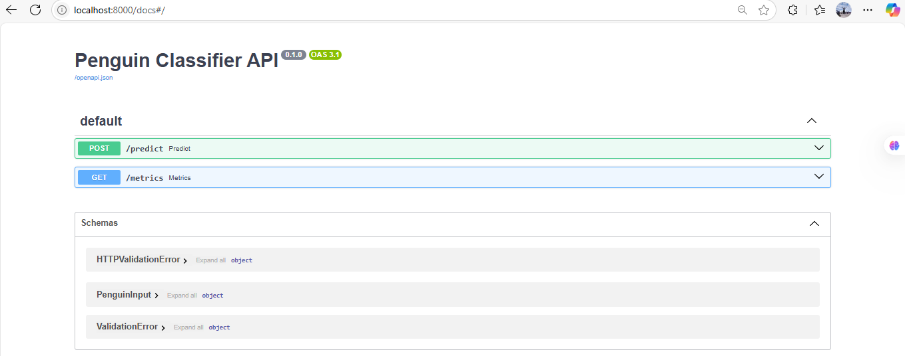
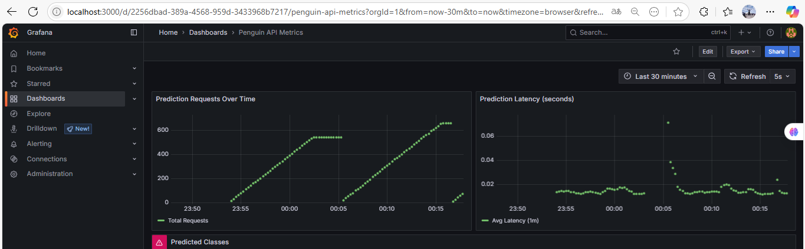
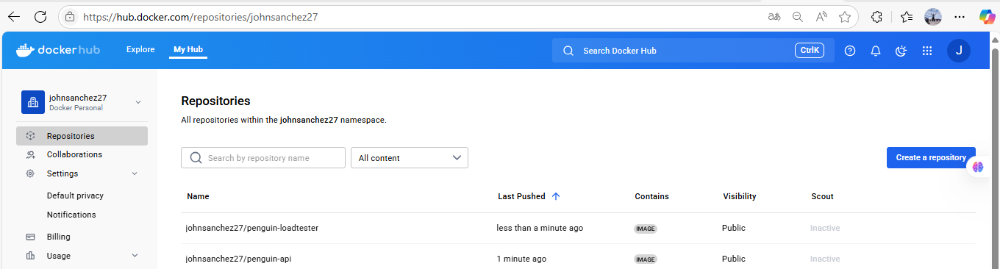
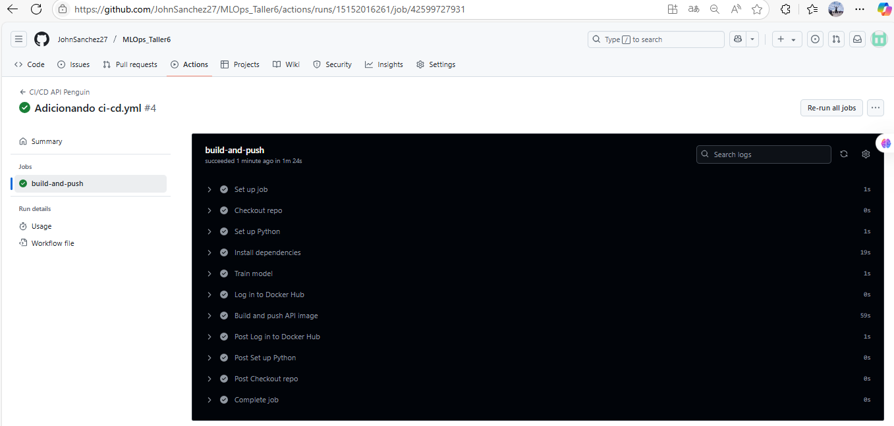
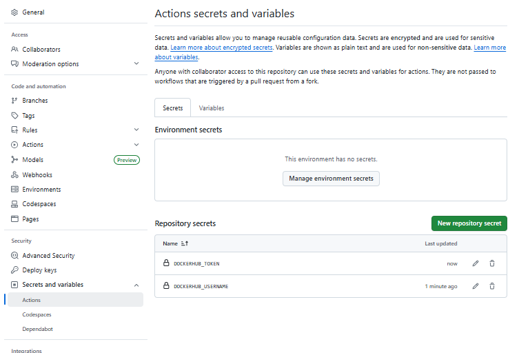
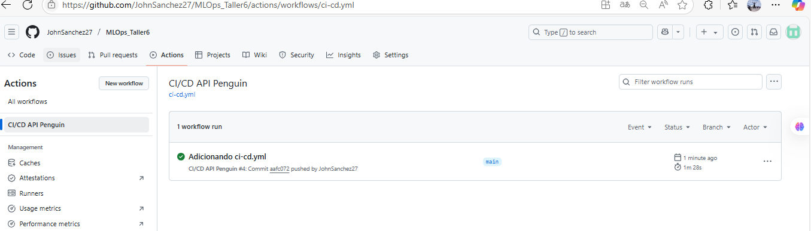

# Taller CI/CD + Observabilidad para API de IA

Este proyecto implementa una arquitectura completa con Docker, Prometheus, Grafana y despliegue listo para Kubernetes, basada en una API de predicción desarrollada con FastAPI y un modelo de clasificación de pingüinos.

---

## 🔍 Descripción General

La solución incluye:

- **API FastAPI** para predicción de especies de pingüinos
- **Modelo entrenado (`model.pkl`)** usando `train_model.py`
- **Endpoint `/predict`** para recibir inputs y retornar la especie
- **Endpoint `/metrics`** para exponer métricas Prometheus
- **LoadTester** para simular tráfico de peticiones
- **Prometheus** para monitorear métricas en tiempo real
- **Grafana** para visualizar las métricas
- **Docker Compose** para orquestar todos los servicios
- **Imágenes publicadas en Docker Hub**
- **Listo para ser desplegado en MicroK8s**

---

## 📁 Estructura del Proyecto

```
TALLER_6/
├── api/
│   ├── Dockerfile_app
│   ├── requirements_app.txt
│   ├── train_model.py
│   └── app/
│       ├── main.py
│       └── model.pkl
├── grafana/
│   ├── penguin_api_dashboard.json
├── loadtester/
│   ├── Dockerfile_loadtester
│   ├── main_loadtester.py
│   └── requirements_loadtester.txt
├── manifests/
│   ├── api-deployment.yaml
│   └── api-service.yaml
│   └── grafana-deployment.yaml
│   └── grafana-service.yaml
│   └── loadtester-deployment.yaml
│   └── prometheus-cm0-configmap.yaml
│   └── prometheus-deployment.yaml
│   └── prometheus-service.yaml
├── prometheus/
│   ├── prometheus.yml
│   └── grafana-config/
│       └── datasources/
│           └── datasource.yml
├── docker-compose.yml
```

---

## 🚀 Instrucciones de Ejecución

### 1. Construcción y despliegue local

```bash
docker-compose up --build
```

Servicios disponibles:
- API: Es la API principal que ofrece un endpoint /predict para recibir atributos morfológicos de un pingüino y retornar la especie predicha (Adelie, Chinstrap o Gentoo). También expone /metrics para exponer datos monitoreables en formato Prometheus. Fue desarrollada con FastAPI y sirve un modelo previamente entrenado y serializado (model.pkl).

 http://localhost:8000/docs



- Prometheus: Prometheus es el sistema de monitoreo que consulta la API cada 5 segundos para scrapear las métricas disponibles en /metrics. Estas métricas incluyen número total de peticiones, latencias y predicciones por clase. Prometheus guarda estas métricas y permite hacer consultas personalizadas para análisis.

http://localhost:9090


- Grafana: http://localhost:3000 (user: `admin`, pass: `admin`)

Grafana permite visualizar gráficamente las métricas capturadas por Prometheus. A través de un dashboard importable, puedes monitorear peticiones por segundo, latencia promedio, y distribución por especie predicha. El dashboard personalizado está disponible en grafana/penguin_api_dashboard.json.



-  LoadTester (sin interfaz):
Este servicio es un contenedor que envía peticiones POST al endpoint /predict de la API cada segundo con datos aleatorios simulados. Su función es generar carga de uso realista para permitir pruebas de rendimiento y monitoreo continuo. No requiere intervención manual.

### 2. Métricas implementadas

- `predict_requests_total`
- `predict_request_latency_seconds`
- `predicted_class`

Visualizables en Grafana con el dashboard incluido (`penguin_api_dashboard.json`).

---

## 🐳 Imágenes Docker públicas

- `johnsanchez27/penguin-api:latest`
- `johnsanchez27/penguin-loadtester:latest`




---

## 📈 Dashboard Grafana

Archivo `penguin_api_dashboard.json` disponible para importar directamente en Grafana.

## Github Actions

Se logró implementar el GitHub actions mediante la carpeta .github y el archivo dentro de ella .yml, se le ha indicado a Github que cada vez que se hace push a la rama main, él vuelve a levantar el contenedor de entrenamiento, y hace push en DockerHub actualizando la imagen que se utiliza. Esto nos permite tener una integración continua, para lograr la actualización en DockerHub fue necesario definir variables de entorno de tipo secreto con el username y el password



### Secrets


Logrando esto, el workflow ha sido exitoso como se muestra a continuación




---

## ☸️ Listo para MicroK8s

Se procede a la creación de un docker-composeku.yaml con el cual se montaron las imágenes de FastAPI y de loadtester, grafana y prometheus, con el fin de levantar los servicios a traves de kubernetes y se siguieron estos pasos

1. Crear el archivo docker-compose.yaml
2. Desplegar microK8s
   
```bash

microk8s kubectl apply -f docker-compose.yaml

```
3. Verificar los pods y servicios
```bash

microk8s kubectl get pods
microk8s kubectl get services

```

4. Acceder a los servicios
Usa los puertos expuestos para acceder y utilizar cada uno de los servicios


