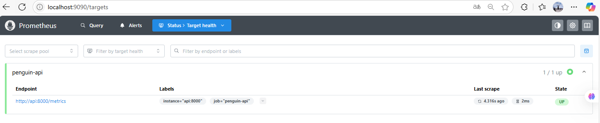

# Taller CI/CD + Observabilidad para API de IA

Este proyecto implementa una arquitectura completa con Docker, Prometheus, Grafana y despliegue listo para Kubernetes, basada en una API de predicción desarrollada con FastAPI y un modelo de clasificación de pingüinos.

---

## 🔍 Descripción General

La solución incluye:

- **API FastAPI** para predicción de especies de pingüinos
- **Modelo entrenado (`model.pkl`)** usando `train_model.py`
- **Endpoint `/predict`** para recibir inputs y retornar la especie
- **Endpoint `/metrics`** para exponer métricas Prometheus
- **LoadTester** para simular tráfico de peticiones
- **Prometheus** para monitorear métricas en tiempo real
- **Grafana** para visualizar las métricas
- **Docker Compose** para orquestar todos los servicios
- **Imágenes publicadas en Docker Hub**
- **Listo para ser desplegado en MicroK8s**

---

## 📁 Estructura del Proyecto

```
TALLER_6/
├── api/
│   ├── Dockerfile_app
│   ├── requirements_app.txt
│   ├── train_model.py
│   └── app/
│       ├── main.py
│       └── model.pkl
├── grafana/
│   ├── penguin_api_dashboard.json
├── loadtester/
│   ├── Dockerfile_loadtester
│   ├── main_loadtester.py
│   └── requirements_loadtester.txt
├── prometheus/
│   ├── prometheus.yml
│   └── grafana-config/
│       └── datasources/
│           └── datasource.yml
├── docker-compose.yml
```

---

## 🚀 Instrucciones de Ejecución

### 1. Construcción y despliegue local

```bash
docker-compose up --build
```

Servicios disponibles:
- API: http://localhost:8000/docs


- Prometheus: http://localhost:9090



- Grafana: http://localhost:3000 (user: `admin`, pass: `admin`)


### 2. Métricas implementadas

- `predict_requests_total`
- `predict_request_latency_seconds`
- `predicted_class`

Visualizables en Grafana con el dashboard incluido (`penguin_api_dashboard.json`).

---

## 🐳 Imágenes Docker públicas

- `johnsanchez27/penguin-api:latest`
- `johnsanchez27/penguin-loadtester:latest`


---

## ☸️ Listo para MicroK8s (Siguiente paso para crear los manifiestos)

Puedes usar las imágenes anteriores en tus `Deployment` y `Service` YAML. Ejemplo para la API:

```yaml
containers:
  - name: penguin-api
    image: johnsanchez27/penguin-api:latest
    ports:
      - containerPort: 8000
```

---

## 📈 Dashboard Grafana

Archivo `penguin_api_dashboard.json` disponible para importar directamente en Grafana.

---